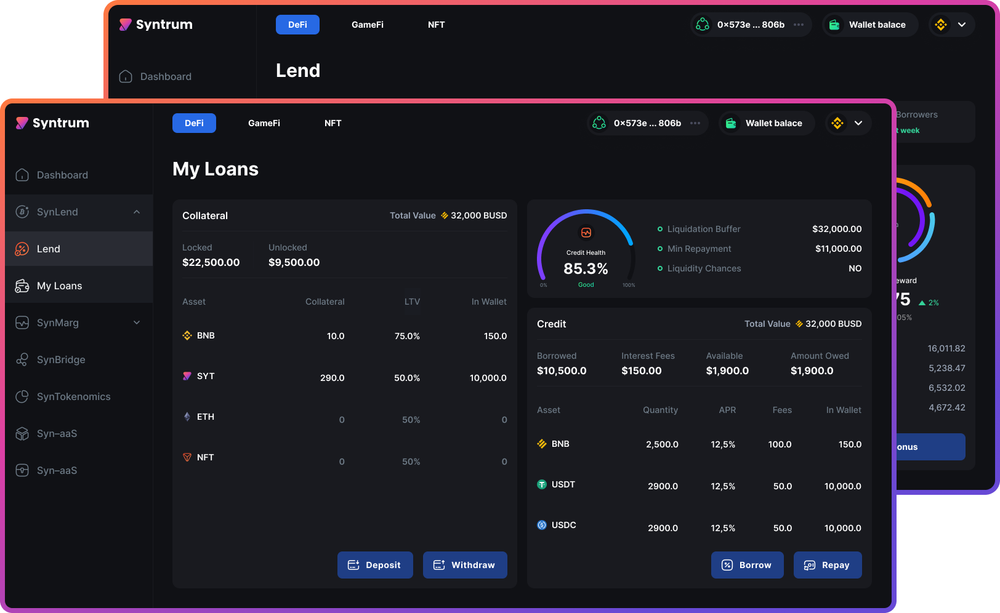

# SynLend


**SynLend: A**


<figure><figcaption></figcaption></figure>

\
The following is a detailed description of the protocol

### Supported Assets

#### **1.   List of assets that can be Lent to or borrowed from the protocol:**

Only stable coins can be lent to or borrowed from the protocol.

i.   On BSC, only BUSD and USDT can be lent or borrowed

ii.  On Polygon, only USDC and USDT can be lent or borrowed.

#### 2.  **List of assets that can be used as collateral:**

i.   On BSC, BNB, ETNA token and ETNA NFTs are assets that can be used as collateral. Any other ERC20 token on BSC can be integrated at a later time.

ii.  On Polygon, Matic, ETNA token and ETNA NFTs are assets that can be used as collateral. Any other ERC20 token on Polygon can be integrated at a later time.&#x20;

### &#x20;Lending and Borrowing Interest Rates

#### **1.     Interest rate of Stable coin lent to or borrowed from the protocol:**

The interest rates algorithm is as follows:

&#x20;   &#x20;

This gives the lending rate as:&#x20;

#### $$r_c=r_{c(min)}+\frac{P_B}{0.95}\times(r_{c(max)}-r_{c(min)})$$

And the borrowing rate as:

#### $$r_b=r_{b(min)}+\frac{P_B}{0.95}\times(r_{b(max)}-r_{b(min)})$$

The above rates are variable so when they change as $$P_B$$ changes, active loan rates and active deposits (assets lent to the platform) rates also changes except for borrowers who took a loan at a fixed rate. In this case, the borrower’s rate is at a premium and it is given by:

#### &#x20;$$r_{b(fix)}=r_f+r_{b(min)}+\frac{P_B}{0.95}\times(r_{b(max)}-r_{b(min)})$$

i.e, such a borrower's rate is increased by $$r_f$$ and in this case, it stays fixed even if the rates in the protocol changes due to changes in $$P_B$$.

&#x20;

Where  $$P_B$$ is the ration of amount borrowed to total deposited for any given borrowable asset. It is which given by:

#### $$P_B= \frac{Q_{BORROWED}}{Q_{TOTAL}}$$

**Note:** Whenever $$P_B$$ goes above 0.95 (say 0.951), borrowing access for that particular asset stops until the percentage drops either by some borrowers paying back all or part of their loans or more lenders lending to the protocol.

### **FOR EXAMPLE:**

If the total amount of BUSD lent to the protocol at a given time is $$Q_{TOTAL}=480,000$$ and total amount already borrowed is $$Q_{BORROWED}=250,000$$ then we have:

$$P_B=\frac{250,000}{480,000} = 0.5208$$

With the following parameters set as follows:

$$r_{c(min)}=10\%$$ and $$r_{c(max)}=20\%$$

&#x20;$$r_{b(min)}=13\%$$, $$r_{b(max)}=30\%$$ and $$r_{f}=5\%$$.

**Then lenders get paid:**

#### $$r_c=10+\frac{0.5208}{0.95}\times(20-10)=15.48\%$$&#x20;

**And borrowers get charged:**

#### $$r_b=13+\frac{0.5208}{0.95}\times(30-13)=22.32\%$$

With both the lender's and the borrower's rates varying as $$P_B$$ changes.

#### Borrowing Fixed Rate:

If the borrower rather takes the loan at a fixed rate, such a borrower will be charged a fixed interest rate of:

#### $$r_{b(fix)}=5\%+22.32\% = 27.32\%$$

#### Exceptions with ETNA assets used as collateral:

**There is an exception when a borrower's loan is collateralized with ETNA tokens or ETNA NFTs. In both cases, the loan are at zero interest rate charged.**

### **Collateral Borrowing Power**&#x20;

Each collateral asset has a borrowing power defined by a borrowing factor $$B_F$$. For each collateral asset, the maximum amount that can be borrowed $$A_{borrow}$$ is given by:

#### $$A_{borrow}=Col_{value}\times B_F$$

&#x20;Where $$Col_{value}$$ is the value of the collateral or collaterals used.

#### **For example:**

For a collateral asset (say ETNA Token) with $$B_F=0.25$$. If a borrower uses ETNA that worth $10,000 as collateral, the maximum amount the borrower can take out as loan is:

$$A_{borrow}=10,000 \times 0.25 = \$2,500$$&#x20;

Which can be taken out in BUSD, USDC or USDT.

With this collateral value, the user can take out a maximum of 2500 but can choose borrow any amount between 0 – 2,500 BUSD/USDC, the remaining amount not taken will remain as accessible credit that can be taken at a later time.

### &#x20;**Loan Liquidation**

With depreciation of the value of the collateral used by a borrower, the loan taken by the borrower is flagged for liquidation if the collateral depreciates up to a certain value.&#x20;

**The value at which liquidation flagging occurs is determined by a liquidation factor** $$L_F$$**.**

The value the collateral depreciates to, at which loan is flagged for liquidation ($$Col_{value(L)}$$) is also dependent on the amount borrowed and it is given by:

#### $$Col_{value(L)}=A_{borrowed}\times (1+L_F)$$

For example, if $$L_F=0.2$$ and the user takes out the max amount of $$2,500$$ BUSD, then the loan is flagged for liquidation when the collateral value drops to:

#### $$Col_{value(L)}=2,500\times (1+0.2)=\$3,000$$&#x20;

The borrower can prevent liquidation by paying back some part or the whole loan or by depositing more collateral to increase his borrowable limit.

### &#x20;**Liquidation Amount**

When liquidation occurs, the total amount by which the loan is deliquescent is liquidated plus a liquidation fee, this is given by:

#### $$A_{liquidation}=A_{borrowed}\times (1+L_{fee})$$

&#x20;Where $$L_{fee}$$ is the liquidation fee factor.

Therefore if $$L_{fee}=0.1$$, for the loan in the previous section, the amount of the borrower’s collateral that is liquidated is:

$$A_{liquidation}=2500\times (1+0.1) =\$2,750$$

Since the collateral in this example is ETNA, then ETNA amount that worth $2,750 is liquidated.

Again, user can prevent this by paying all or part of the loan back or by depositing more collateral to increase his/her borrowable limit.

### **Liquidation Mechanism:**

The protocol have a function for appointing liquidator account roles. It allows the appointment of up to 100 accounts to be liquidators. When an account is appointed as a liquidator, such an account can see loans that are flagged for liquidation, this displays in the liquidation dashboard.

Accounts appointed are only accounts from users of the vault contract. Top users of the vault are appointed to be liquidators.

#### Liquidator payment:

The liquidation fee is given by:

#### $$Liquidation_{fee}=A_{liquidation}-A_{borrowed} =A_{borrowed}\times L_{fee}$$

As with the above example where $$L_{fee}=0.1$$, the total fee charged for liquidation is:

#### $$Liquidation_{fee}=2,500\times 0.1 =\$250$$

The payment for liquidators is a percentage of this fee defined by a payment parameter $$P_{liquidator}$$. This payment is given by:&#x20;

#### $$Liquidator_{payment}=Liquidation_{fee}\times P_{liquidator}$$

with $$P_{liquidator}=0.4$$, the liquidator's payment is:

#### $$Liquidator_{payment}=250\times 0.4 =\$100$$

#### Admin payment:

The remaining portion of the liquidation fee is paid as an admin fee and it is given by:

$$Admin_{payment}=Liquidation_{fee}\times (1-P_{liquidator})$$

For this example, we have $$Admin_{payment}=\$150$$.

### Amount Borrowed vs Amount owed

For example, in this senerio, user deposited the following:

10000 ETNA which worths $2000

10 BNB which worths $6000

ETNA Borrowing factor is 0.2 and BNB Borrowing factor is 0.3

This means the user allowed borrowing amount is: 2000x0.2 + 6000x0.3 = $2200

If user borrowed all the $2200.

If user does not pay anything back, with effective apr = 7.5% (assuming constant for calculation purpose), after a year user will owe = 2365

If also the liquidation occurs when calateral value dropped to amount owed\*(1+0.25) = 2365 x 1.25 =2956.25

at this time, let us asume the collateral sum total is now 2940 due to market crash. Liquidation should always take the most from BNB and then the rest from ETNA. so if there is any portion of collateral to be returned in the case of multiple collateral, it should be ETNA to be returned since liquidation will always take the most possible from other collaterals used and then what ever remaining to be taken is taken from ETNA

### Take the most from other collateral first

#### **Note:** All the dollar values are calculated in terms of the collateral used and at the market rate at the time the liquidation occurred.
