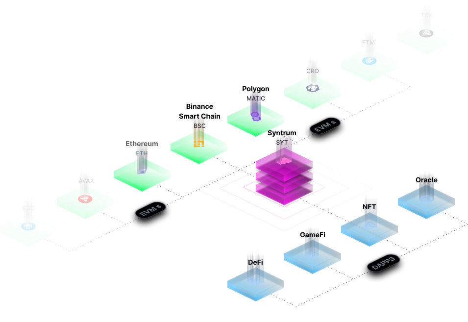

# Syntrum Chain

<figure><figcaption></figcaption></figure>

Syntrum is a cutting-edge, multi-layer blockchain infrastructure and ecosystem designed with scalability, interoperability, and cost-effectiveness in mind. It provides developers and projects with the tools and services they need to grow and succeed.

Syntrum uses a unique blend of Proof of Staked Authority (PoSA) and Proof of Value (PoV) consensus mechanisms to achieve gasless transactions while eliminating network spamming and real-time multi-network synchronization through its network mirroring technology. This results in seamless interoperability between decentralized applications on different blockchains without the need for layer 2 bridge solutions.

Say goodbye to the vulnerabilities and single points of failure posed by centralized, unsecured bridge solutions. With Syntrum's blockchain, applications can achieve true interoperability in real-time, without the need to be deployed on multiple chains. Users can enjoy the features of any dApp without having to move their crypto assets. This is the future of blockchain interoperability and transversal dApps.
